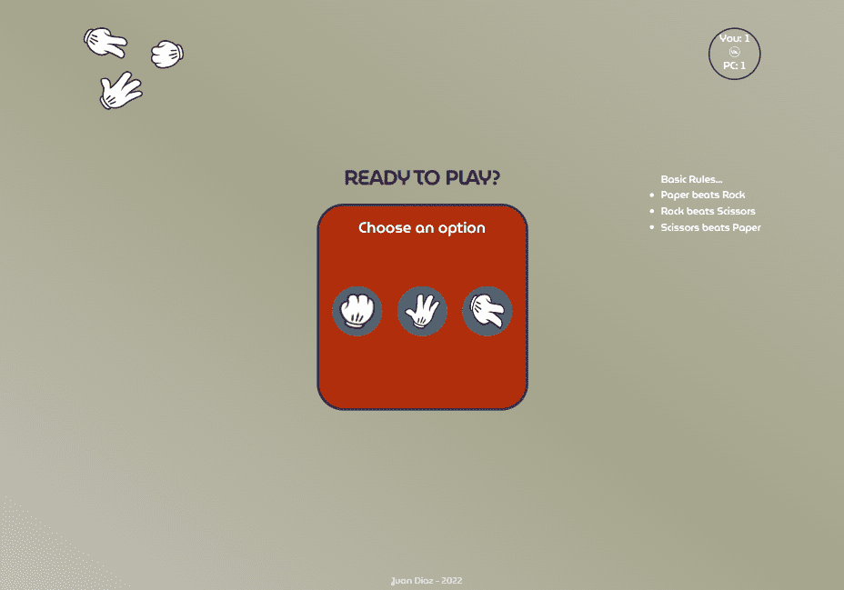
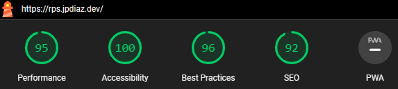

# Rock ✊ Paper 🤚 Scissors ✌ Game

<!-- ABOUT THE PROJECT -->

## Description 💡
---
> Rock paper scissors is a hand game usually played between two people, in which each player simultaneously forms one of three shapes with an outstretched hand. These shapes are "rock", "paper", and "scissors". This project was developed using JavaScript ❤ HTML and CSS but my main focus was JS.
---
<!-- BUILD WITH -->

## Built With 🔑

This project was bootstrapped with discipline and hard work.

This project was build with Hyper Text Markup Language (HTML), Cascading Style Sheets(CSS) and Javascript (JS).

## How To Play

Basic Rules...

    The rules are very simple and probably you remember them from your childhood :
          ♦ If you choose Rock, you will win against Scissors but lose against Paper.
          ♦ If you choose Scissors, you will win against Paper but lose against Rock.
          ♦ If you choose Paper, you will win against Rock but lose against Scissors.

## Fun Facts of RPS game (Souurce Wiki)😜
- Did you know that this game first appeared in China in the 17th century? Yes, it was not invented in Europe or America but in Asia. Europe started to play this game only in 19th century.
- Statistics say that people usually choose Scissors in the first round and Rock in the second.

<!-- CONTENT -->

## Content 🚦

Classic game ROCK, PAPER, SCISSORS to play in the browser. Responsive Design built with JavaScript.

### Project deployed using:

 - Vercel: [View Demo](https://rock-paper-scissors-jpdiaz.vercel.app/) 👈 Live Demo Link 

- Github Pages: [https://juanpablodiaz.github.io/rock-paper-scissors](https://juanpablodiaz.github.io/rock-paper-scissors/)

<!-- VIEWS -->

### Desktop Screen 💻

### Lighthouse Score 🚀

<!-- LICENSE -->

## License 📜

Distributed under the MIT License. See `LICENSE.txt` for more information.
- Inspired by [Frontend Mentor Challenge](https://www.frontendmentor.io/challenges/rock-paper-scissors-game-pTgwgvgH) & [Platzi](https://www.platzi.com)

<!-- PROJECTS -->

## Projects 🚀

<!-- CONTACT -->

## Contact 📞

 ## Courses & Certifications

 To find more about the courses I took and the certificates I have please click on my [profile](https://platzi.com/p/DiazJuan/).
<!-- ACKNOWLEDGMENTS -->

## Acknowledgments 📚

Resources list that I find helpful and would like to give credit to.

- [w3schools](https://www.w3schools.com/)
- [Tiny png](https://tinypng.com/)
- [awesome-readme](https://github.com/matiassingers/awesome-readme)
- [PurpleBooth](https://gist.github.com/PurpleBooth/109311bb0361f32d87a2)
- [dbader](https://github.com/dbader/readme-template)
- [zenorocha](https://gist.github.com/zenorocha/4526327)
- [fvcproductions](https://gist.github.com/fvcproductions/1bfc2d4aecb01a834b46)
- [Git doc](https://git-scm.com/doc)

(<a href="#top">👆top👆</a>)

